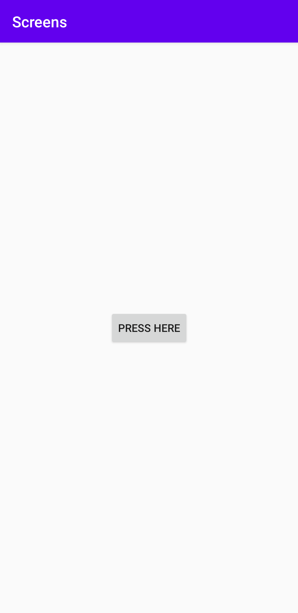

## Rapport
Först skapades en ny Aktivitet / Acitivty för att lägga till en andra skärm genom att gå in på `File > New > Activity > Basic Activity`. Detta lägger automatiskt till nödvändig kod och nya filer, där det inom intresse är **activity_screen.xml**. Denna fil är layouten för den nya skrämen, där fragmenten ska läggas till med en *fragment* tag:

    <fragment  
      android:id="@+id/fragment"  
      android:name="com.example.screens.BlankFragment" <!-- Länkar till fragmenten -->  
      android:layout_width="wrap_content"  
      android:layout_height="wrap_content"  
      app:layout_constraintBottom_toBottomOf="parent"  
      app:layout_constraintEnd_toEndOf="parent"  
      app:layout_constraintStart_toStartOf="parent"  
      app:layout_constraintTop_toTopOf="parent" />

Denna fragment skapades genom att gå på `File > New > Fragment > Fragment (Blank)`. Detta lägger till nya fragment filer, där **fragment_blank.xml** är det av intresse då det är där som inehåll läggs till, i detta fallet en enkel *TextView*:

    <TextView  
      android:layout_width="wrap_content"  
      android:layout_height="wrap_content"  
      android:text="@string/Fragment_Text_Here"  
      app:layout_constraintBottom_toBottomOf="parent"  
      app:layout_constraintLeft_toLeftOf="parent"  
      app:layout_constraintRight_toRightOf="parent"  
      app:layout_constraintTop_toTopOf="parent" /> 
För att starta den andra skärmen med fragmenten användes *intent* i **MainActivity.java**. En *OnClickListener* lyssnar efter ett knapptryck från knappen för att sedan aktivera den:

    Button button = findViewById(R.id.button);  
    button.setOnClickListener(new View.OnClickListener() {  
      @Override  
      public void onClick(View v) {  
      Intent intent = new Intent(MainActivity.this, Screen.class);  
      startActivity(intent);
      }

och en knapp som aktiverar den i **activity_main.xml**:

    <Button  
      android:id="@+id/button"  
      android:layout_width="wrap_content"  
      android:layout_height="wrap_content"  
      android:text="HPress here"  
      app:layout_constraintBottom_toBottomOf="parent"  
      app:layout_constraintLeft_toLeftOf="parent"  
      app:layout_constraintRight_toRightOf="parent"  
      app:layout_constraintTop_toTopOf="parent"/>

